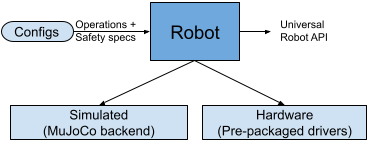

# Robot interface
RoboHive uses an abstracted class called `robot` to interface with all agents/devices. Goal of the `robot` class is to
1. Abstract out the difference between a `simulation` vs `hardware` instantiation of our agents.
2. Provide a unified interface to specify operational+safety [configurations]().



RoboHive's goal is the make hardware as seemless to use as simulations. In order to achive this, RoboHive projects hardware into simulation. Conceptually, this implies that all our computations happen as if we are always working in a simulated setting, hardware merely is a dynamic function that updates the sim. This has a few fundamental benefits
1. Interpretability of the simulation carried over to hardare. Users donot needs to know all the hardware details.
2. It's easy to prototype in simulation and later port results into hardare. This is very useful for paradigms like sim2real.
3. Simulation provides a general parameterizariton to the hardware details when its important.
4. Simulation rendering can be used as a real time vizualizer for the hardware updates.

## Simulated Robot
Robohive uses MuJoCo has its simulated backbone. Since RoboHive operates in the simulation space, one can directly interact with our simulation for any computation/update.

## Hardware Robot
RoboHive provides a unified [base class](hardware_base.py) for all hardware interfaces. RoboHive comes pre-packaged with a few hardware intrefaces for a few common robots. It's also easy to add new interface. Interfaces are picked and configured using a [configuration file](). Goal of the harware interface is to be the background process that pulls and pushes all updates to the simulation and hide all hardware details from the RoboHive users.

1. [Franke Emika Arm](https://www.franka.de/)
RoboHive uses [Polymetis](https://facebookresearch.github.io/fairo/polymetis/) for interfacing with Franka Arms. Please follow the install instructions provided by the Polymetis authors.

2. [Dynamixel](http://www.dynamixel.com/)
RoboHive supports all dynamixel based robots such as [ROBEL](http://roboticsbenchmarks.org/). Please follow driver install instructions [here](https://github.com/vikashplus/dynamixel).

3. [OptiTrack](https://optitrack.com/)
RoboHive supports optitrack motion tracking system. Please follow install instructons [here](https://github.com/vikashplus/OptiTrack)


4. [Robotiq Grippers](https://robotiq.com)
RoboHive uses [Polymetis](https://facebookresearch.github.io/fairo/polymetis/) for interfacing with robotiq grippers. Please follow the install instructions provided by the Polymetis authors.

5. [Real-Sense cameras](https://www.intelrealsense.com/)
Robohive relies on a pub-sub framework from [Fairo](https://github.com/facebookresearch/fairo) to interact with intel realsense cameras. Quick install
to get the a0 dependencies `pip install alephzero`

## Configuration
Robot configurations are specified using a config files. The file is essentially a nested dict that specified details about the robot's `interface`, `sensor`, `actuator`, and `cams` configurations. See below for an example.
```
{
# device1:  interface, sensors, actuators, cams configs
'franka':{
    'interface': {'type': 'franka', 'ip_address':'172.16.0.1', 'gain_scale':0.5},
    'sensor':[
        {'range':(-2.9, 2.9), 'noise':0.05, 'hdr_id':0, 'scale':1, 'offset':0, 'name':'fr_arm_jp1'},
        {'range':(-1.8, 1.8), 'noise':0.05, 'hdr_id':1, 'scale':1, 'offset':0, 'name':'fr_arm_jp2'},
    ],
    'actuator':[
        {'pos_range':(-2.9, 2.9), 'vel_range':(-2, 2), 'hdr_id':0, 'scale':1, 'offset':0, 'name':'panda0_joint1'},
        {'pos_range':(-1.8, 1.8), 'vel_range':(-2, 2), 'hdr_id':1, 'scale':1, 'offset':0, 'name':'panda0_joint2'},
    ],
    'cams': []
},

# device2: interface, sensors, actuators, cams configs
'robotiq':{
    'interface': {'type': 'robotiq', 'ip_address':'172.16.0.1'},
    'sensor':[
        {'range':(0, 0.834), 'noise':0.0, 'hdr_id':0, 'name':'robotiq_2f_85', 'scale':-9.81, 'offset':0.834},
    ],
    'actuator':[
        {'pos_range':(0, 1), 'vel_range':(-2, 4), 'hdr_id':0, 'name':'robotiq_2f_85', 'scale':-0.08, 'offset':0.08},
    ],
    'cams': []
},

# device3: interface, sensors, actuators, cams configs
'right_cam':{
    'interface': {'type': 'realsense', 'rgb_topic':'image_rgb', 'd_topic':'image_d'},
    'sensor':[],
    'actuator':[]
    'cams': [
        {'range':(0, 255), 'noise':0.00, 'hdr_id':'rgb', 'scale':1, 'offset':0, 'name':'/color/image_raw'},
        {'range':(0, 255), 'noise':0.00, 'hdr_id':'d', 'scale':1, 'offset':0, 'name':'/depth_uncolored/image_raw'},
    ],
},
```
RoboHive [robot](robot.py) class consumes the simulation and the configurations files to provide a unified class that can be used as a general robot abstraction -- either inside a MDP (OpenAI-gym, DM-Control) formulation, or to directly talk to the robot ([tutorial](../tutorials/examine_robot.py)).